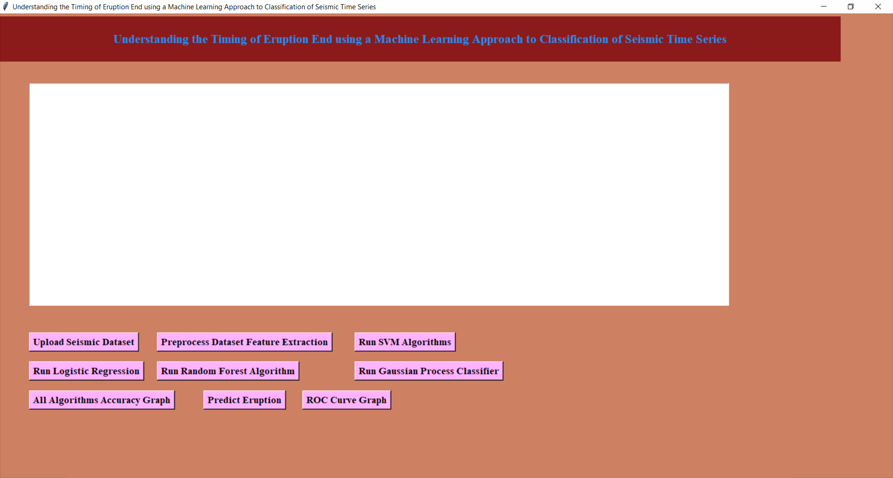
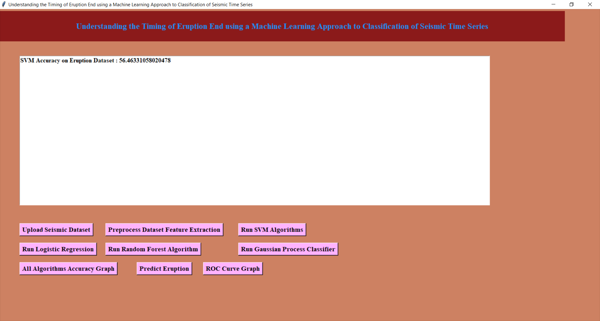
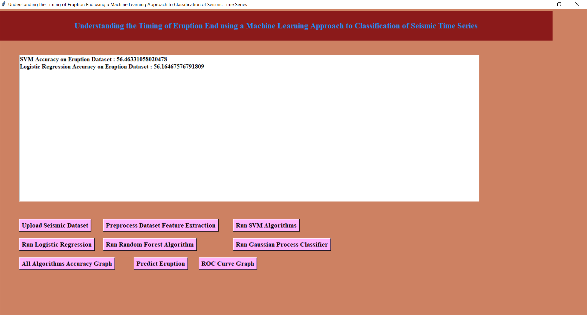
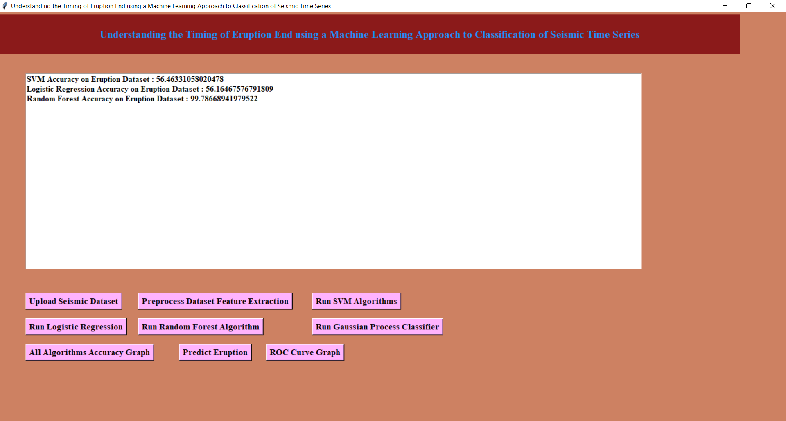
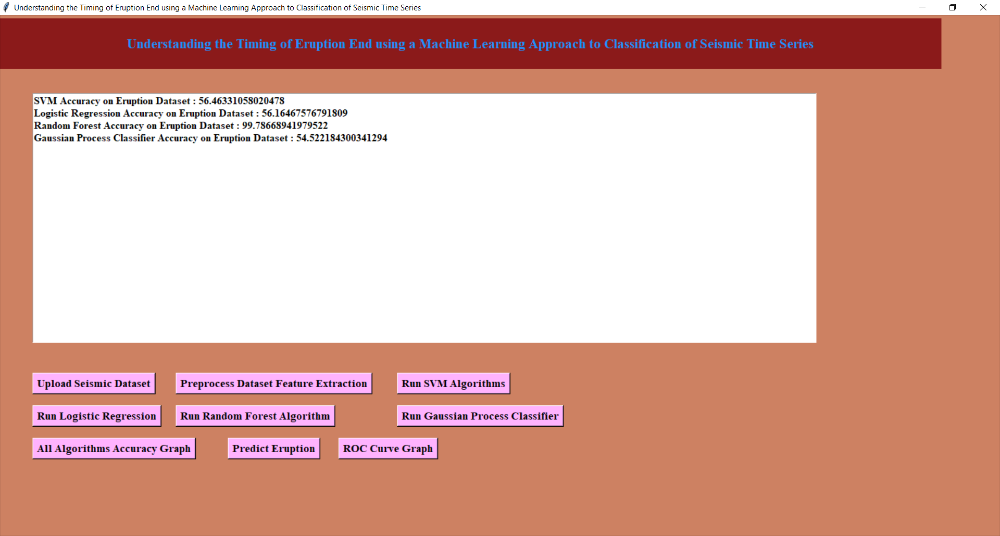

# Understanding the timing of eruption end using a machine learning approach to classification of seismic time series

`A GUI project completed using a machine learning approach by M. Madumitha, V. Pravarsha, J. Naveen and P. Raghavendra.`

Volcanic eruptions are magnificent and sometimes the deadliest natural events on Earth. Predicting a volcanic eruption is a challenging task. Various factors trigger a volcanic eruption, but there are three main factors that trigger an eruption, the first factor is the buoyancy of the magma; the second factor is the pressure due to the gases dissolved in the magma; the third factor: Injection of a new batch of magma into an already filled magma chamber. It also is believed that sometimes tectonic earthquakes can also cause volcanic eruptions.

Our **primary focus is on Japan** because it is the only country that receives maximum earthquakes every year. It is also the fourth country with the maximum number of volcanoes.Japan is located along the pacific ring of fire, the most active earthquake belts globally. Most of the worlds earthquakes and volcanic eruptions occur here. Moreover, Japan sits on the boundary of four tectonic plates: the Pacific late, the North American Plate, the Eurasian Plate, and the Filipino plate. These reasons make Japan an earthquake-prone zone.

## Getting Started
Make sure you have installed latest version of Python, GitSCM or GithubCLI is installed on your machine. From your command line, clone and install the required python packages.
```
# Clone this repository
$ git clone https://github.com/naveenjujaray/Eruption.git
or
$ gh repo clone naveenjujaray/Eruption

# Go into the repository
$ cd Eruption

# Open the run.bat file 
or
# Run Eruption.py file in Python IDE, VS Code, Jupiter or CMD/PS

# Then follow as below
```













.png)

.png)

.png)

.png)


